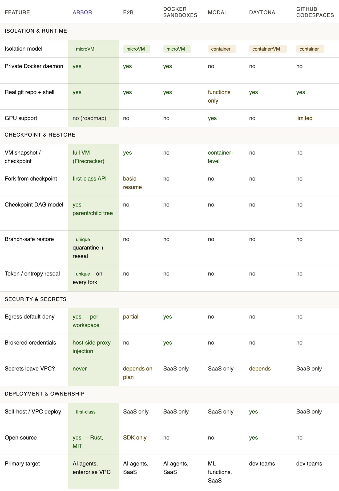

The need for an AI agent sandbox became obvious within days of emerging needs of code agent.

### What is Sandbox?
An AI agent sandbox is a secure, isolated, and typically ephemeral cloud environment designed to allow autonomous AI agents to execute code, browse the web, and interact with files without posing risks to the host system, user credentials, or production data.
By early 2026, Cloudflare, Vercel, Ramp, and Modal all shipped sandbox features. Dedicated providers like E2B, Northflank, and Firecrawl built entire platforms around the problem.

### Why do we need sandbox?
- Safety: An AI agent sandbox completely isolates agent execution from your host system, cloud credentials, and sensitive production data.
- Environment: Agents need to actively run to get more runtime information for feedback loop / reasoning
- Scalability — Ability to run thousands of concurrent sandboxes
- Isolation — Code runs in VMs or containers, separated from host systems

### What is difference between the previous sandbox we had? Like docker, KVM?
Key distinction from cloud compute: These are purpose-built for agent use cases, not general application hosting. They optimize for fast creation, easy cleanup, and developer-friendly SDKs.
- Dedicated sandbox providers like Docker, E2B, Modal, Northflank, and Firecrawl's Browser Sandbox are competing heavily on startup speed, isolation quality, developer experience, and what tooling comes pre-loaded. Agent sandboxing is becoming a distinct category, not just a framework feature.
- Whenever you start a new coding session, you want to spin up a new sandbox that has a full development environment. This will allow the agent to work effectively, by having access to all the tools a human would have, while also being isolated from other work. It’s also crucial that time-to-first-token is as fast as possible.

### The problem Arbor solves

When you run a coding agent on a real repository, three things keep going wrong:

**1. Agents can't safely experiment in parallel.**
If you want to try three different approaches to fixing a bug, you need three isolated environments. Spinning up three fresh VMs from scratch wastes minutes and gigabytes. Existing snapshot tools let you restore a checkpoint — but they don't handle what happens when you restore the *same* snapshot three times. All three copies share the same SSH keys, session tokens, PRNG seeds, and Docker layer cache state. They'll silently collide.

**2. Secrets end up inside the VM.**
The standard pattern — inject an `OPENAI_API_KEY` environment variable into the sandbox — means the agent can read, log, and exfiltrate credentials. An agent executing arbitrary code in a compromised dependency has full access to every secret in its environment.

**3. You can't run this on your own infrastructure.**
Every existing coding sandbox is SaaS-only. If your codebase is proprietary, your compliance team won't let agent traffic touch a third-party cloud. There is no self-hosted option that gives you microVM isolation, checkpoint/restore, and proper secret handling in one coherent system.

Arbor is the answer to all three.

### Different types of sandbox
- There are three main categories of sandboxing: browser sandboxes, code execution sandboxes, and full dev environment sandboxes.
  - For agents that browse the web: Firecrawl Browser Sandbox
  - For agents that execute code: E2B or Modal
  - For full coding agents on real projects: Northflank and Docker

| Sandbox Type    | Best For                                  | Typical Provider | Isolation Level                  |
|-----------------|-------------------------------------------|------------------|----------------------------------|
| Browser Sandbox | LLMs scraping the web, filling forms      | Firecrawl        | Cloud Container                  |
| Code Execution  | Data analysis, shell script execution     | E2B              | MicroVM                          |
| Full Dev Env    | Complex coding agents across repositories | Docker           | Unprivileged Container / MicroVM |

Browser sandboxes come in different forms: some are purpose-built for UI automation and form filling, others for visual testing, and others specifically for web extraction. For workflow automation (multi-step browser flows, form submissions, login sequences), tools like Browserbase are a strong fit. Since web extraction is one of the most critical tools in any AI agent's stack (agents constantly need to retrieve, parse, and reason over live web data), that's the type we'll focus on here.
A browser sandbox for web extraction provides such agents with a fully managed, cloud-hosted browser session environment. The agent can freely navigate pages, click elements, aggressively type form inputs, take screenshots, and run local client-side JavaScript inside a real Chromium instance.

A code execution sandbox gives AI agents a remote runtime environment where they can actively write and execute application code.
This includes performing complex file access operations, running full process executions, and managing ad-hoc dependency package installations. The process runs deep inside an isolated microVM or secured container, structurally walled off from your primary host operating system.

E2B is currently the most widely adopted dedicated provider consistently operating within this technical category. Their robust sandbox architecture is built fundamentally on Firecracker, the exact same battle-tested microVM technology AWS specifically uses to securely isolate AWS Lambda serverless functions.

for current software development, we have higher requirement: Full dev environment sandboxes. 
A coding agent working on real software projects needs a persistent repository, a real shell, language servers, package managers, build tools, and test runners. The challenge is execution with fidelity, persistence, and isolation at the same time.
Standard Docker containers are not a strong enough boundary for that on their own. They still share the host kernel, so a kernel escape is part of the threat model. This is especially risky when models use advanced features like parallel agent execution, where a breach could span numerous concurrent sessions.
The bigger practical issue is control-plane access: if an agent can reach the host Docker daemon or a mounted Docker socket, it can often start new containers with host mounts and bypass most of the isolation you thought you had.

### Why build Arbor?

Arbor is a purpose-built sandbox manager for AI agents, designed to provide secure, isolated, and persistent environments for code execution. It leverages Firecracker microVMs to ensure strong isolation while maintaining fast startup times and a rich development environment.

"Core differentiators" goes deep on the two things no competitor has — branch-safe restore and VPC-first credential brokering — with the actual Firecracker documentation quote as evidence. Quoting the upstream project's own warning makes the problem feel authoritative, not invented.

"Key design decisions" is the section that earns trust from engineers who will read the code. CPU template explanation (T2 vs T2A), memory file lifecycle, and netns egress path — these show that the design choices are deliberate, not accidental.
